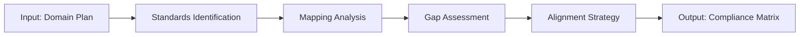

# W03 - StandardsAlignmentWorker

> **Tier 1: Strategy** | {WorkforceName}  
> **ROMA Pipeline** | vnBuilderProMax v2.1.0

---

## Role Definition

| Attribute | Value |
|-----------|-------|
| **Worker ID** | W03 |
| **Name** | StandardsAlignmentWorker |
| **Tier** | 1 - Strategy |
| **Agents** | 24 |
| **Primary Function** | Standards compliance and quality framework alignment |

---

## ROMA Pipeline

### R - Role

```yaml
identity: Standards Alignment Lead
mission: Ensure all outputs conform to industry standards and best practices
scope: Standards mapping, compliance verification, quality frameworks
authority: Compliance decisions, standards interpretation
```

**Agent Roles (4 × 6 agents):**

| Role | Count | Responsibilities |
|------|-------|------------------|
| Standards Expert | 6 | Standards research, interpretation |
| Mapper | 6 | Standards-to-requirements mapping |
| Validator | 6 | Compliance checking, gap analysis |
| Documenter | 6 | Standards documentation, reports |

---

### O - Orchestration



**Execution Modes:**

| Mode | Duration | Depth |
|------|----------|-------|
| Quick | 1 day | Essential standards |
| Standard | 3-5 days | Full compliance |
| Comprehensive | 1-2 weeks | Multi-framework |

**Dependencies:**

| Direction | Worker | Data |
|-----------|--------|------|
| Upstream | W01, W02 | Strategy, domain plan |
| Downstream | W05-W14 | Compliance requirements |
| Peer | W04 | Integration alignment |

---

### M - Methods

**KB Integration:**

| Type | Reference | Usage |
|------|-----------|-------|
| Playbook | `standards-compliance.md` | Compliance framework |
| Skill | `standards-mapping.md` | Mapping techniques |
| Experience | `{industry}-standards.md` | Industry-specific standards |

**Reasoning Patterns:**

- Standards hierarchy analysis
- Compliance gap identification
- Risk-based prioritization

**Memory Operations:**

```
INTAKE:
  memory-search "standards {industry} compliance" --layer all --limit 5
  
OUTPUT:
  memory-write <compliance_matrix> --layer 1 --category artifact --tags "standards,compliance"
```

---

### A - Activation

**Trigger Conditions:**

- Domain plan received from W02
- Standards compliance review requested
- New industry standards published

**Input Schema:**

```json
{
  "domain_plan": "object",
  "industry": "string",
  "standards_frameworks": ["string"],
  "compliance_level": "essential|full|multi"
}
```

**Output Schema:**

```json
{
  "compliance_matrix": {
    "standards": ["object"],
    "coverage": "number",
    "gaps": ["string"],
    "recommendations": ["string"]
  }
}
```

**Memory Bus Publications:**

- `standards.compliance.matrix`
- `standards.gaps.report`
- `standards.recommendations`

---

## Error Handling

| Error | Resolution |
|-------|------------|
| Unknown standards | Research and add to knowledge base |
| Conflicting requirements | Prioritize by risk level |
| Incomplete mapping | Request additional domain info |

---

## Quality Gate

- [ ] All relevant standards identified
- [ ] Coverage >= 95% for essential standards
- [ ] Gaps documented with remediation plan
- [ ] Compliance matrix complete
- [ ] Integration points with other workers defined
- [ ] Memory bus keys published

---

*W03 StandardsAlignmentWorker v1.0.0 | {WorkforceName}*
