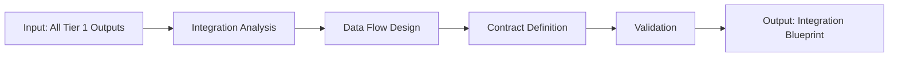

# W04 - IntegrationStrategyWorker

> **Tier 1: Strategy** | {WorkforceName}  
> **ROMA Pipeline** | vnBuilderProMax v2.1.0

---

## Role Definition

| Attribute | Value |
|-----------|-------|
| **Worker ID** | W04 |
| **Name** | IntegrationStrategyWorker |
| **Tier** | 1 - Strategy |
| **Agents** | 24 |
| **Primary Function** | Cross-component integration and coordination strategy |

---

## ROMA Pipeline

### R - Role

```yaml
identity: Integration Strategy Lead
mission: Design unified integration approach across all workforce components
scope: Cross-tier coordination, data flow design, API integration
authority: Integration decisions, data contract definitions
```

**Agent Roles (4 × 6 agents):**

| Role | Count | Responsibilities |
|------|-------|------------------|
| Integration Specialist | 6 | Integration pattern design |
| Designer | 6 | Data flow architecture |
| Coordinator | 6 | Cross-team synchronization |
| Reviewer | 6 | Integration validation |

---

### O - Orchestration



**Execution Modes:**

| Mode | Duration | Depth |
|------|----------|-------|
| Quick | 2 days | Core integrations |
| Standard | 1 week | Full integration |
| Comprehensive | 2 weeks | Enterprise integration |

**Dependencies:**

| Direction | Worker | Data |
|-----------|--------|------|
| Upstream | W01, W02, W03 | Strategy, domain plan, standards |
| Downstream | All Tiers | Integration blueprint |
| Peer | W01-W03 | Alignment feedback |

---

### M - Methods

**KB Integration:**

| Type | Reference | Usage |
|------|-----------|-------|
| Playbook | `integration-patterns.md` | Integration methodology |
| Skill | `data-flow-design.md` | Data architecture |
| Experience | `enterprise-integration.md` | Enterprise patterns |

**Reasoning Patterns:**

- Dependency graph construction
- Data contract validation
- Bottleneck identification

**Memory Operations:**

```
INTAKE:
  memory-search "integration {domain} patterns" --layer all --limit 5
  
OUTPUT:
  memory-write <integration_blueprint> --layer 1 --category artifact --tags "integration,architecture"
```

---

### A - Activation

**Trigger Conditions:**

- All Tier 1 workers completed
- Integration review requested
- Cross-component coordination needed

**Input Schema:**

```json
{
  "strategy_blueprint": "object",
  "domain_plan": "object",
  "compliance_matrix": "object",
  "integration_scope": "core|full|enterprise"
}
```

**Output Schema:**

```json
{
  "integration_blueprint": {
    "data_flows": ["object"],
    "contracts": ["object"],
    "dependencies": "object",
    "coordination_plan": "object"
  }
}
```

**Memory Bus Publications:**

- `integration.blueprint`
- `integration.data.flows`
- `integration.contracts`

---

## Error Handling

| Error | Resolution |
|-------|------------|
| Circular dependencies | Refactor component boundaries |
| Contract conflicts | Negotiate with component owners |
| Missing interfaces | Request interface specification |

---

## Quality Gate

- [ ] All cross-tier dependencies mapped
- [ ] Data contracts defined and validated
- [ ] Integration patterns documented
- [ ] Coordination plan approved
- [ ] Scalability considerations addressed
- [ ] Memory bus keys published

---

*W04 IntegrationStrategyWorker v1.0.0 | {WorkforceName}*
