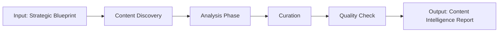

# W05 - ContentIntelligenceWorker

> **Tier 2: Intelligence** | {WorkforceName}  
> **ROMA Pipeline** | vnBuilderProMax v2.1.0

---

## Role Definition

| Attribute | Value |
|-----------|-------|
| **Worker ID** | W05 |
| **Name** | ContentIntelligenceWorker |
| **Tier** | 2 - Intelligence |
| **Agents** | 24 |
| **Primary Function** | Content analysis, curation, and intelligence gathering |

---

## ROMA Pipeline

### R - Role

```yaml
identity: Content Intelligence Lead
mission: Analyze and curate content for optimal knowledge delivery
scope: Content analysis, gap identification, quality assessment
authority: Content recommendations, curation decisions
```

**Agent Roles (4 × 6 agents):**

| Role | Count | Responsibilities |
|------|-------|------------------|
| Content Curator | 6 | Content selection, organization |
| Analyst | 6 | Content gap analysis, quality assessment |
| Researcher | 6 | Content research, benchmarking |
| Evaluator | 6 | Content effectiveness evaluation |

---

### O - Orchestration



**Dependencies:**

| Direction | Worker | Data |
|-----------|--------|------|
| Upstream | W01-W04 | Strategic outputs |
| Downstream | W09-W14 | Content requirements |
| Peer | W06-W08 | Cross-intelligence sync |

---

### M - Methods

**KB Integration:**

| Type | Reference | Usage |
|------|-----------|-------|
| Playbook | `content-analysis.md` | Analysis methodology |
| Skill | `content-curation.md` | Curation techniques |
| Experience | `content-strategy.md` | Industry patterns |

**Memory Operations:**

```
INTAKE:
  memory-search "content {domain} intelligence" --layer all --limit 5
  
OUTPUT:
  memory-write <content_intelligence> --layer 1 --category artifact --tags "content,intelligence"
```

---

### A - Activation

**Trigger Conditions:**

- Strategic blueprint received
- Content analysis requested
- Gap identification needed

**Input Schema:**

```json
{
  "strategic_blueprint": "object",
  "domain": "string",
  "content_scope": "string"
}
```

**Output Schema:**

```json
{
  "content_intelligence": {
    "inventory": ["object"],
    "gaps": ["string"],
    "recommendations": ["string"],
    "quality_scores": "object"
  }
}
```

**Memory Bus Publications:**

- `content.intelligence.report`
- `content.inventory`
- `content.gaps`

---

## Error Handling

| Error | Resolution |
|-------|------------|
| Insufficient content | Trigger content creation request |
| Quality below threshold | Flag for review and enhancement |
| Missing metadata | Request metadata completion |

---

## Quality Gate

- [ ] Content inventory complete
- [ ] Gaps identified and prioritized
- [ ] Quality scores above 0.8
- [ ] Recommendations actionable
- [ ] Integration with content tier ready
- [ ] Memory bus keys published

---

*W05 ContentIntelligenceWorker v1.0.0 | {WorkforceName}*
