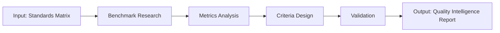

# W06 - QualityIntelligenceWorker

> **Tier 2: Intelligence** | {WorkforceName}  
> **ROMA Pipeline** | vnBuilderProMax v2.1.0

---

## Role Definition

| Attribute | Value |
|-----------|-------|
| **Worker ID** | W06 |
| **Name** | QualityIntelligenceWorker |
| **Tier** | 2 - Intelligence |
| **Agents** | 24 |
| **Primary Function** | Quality assessment and standards intelligence |

---

## ROMA Pipeline

### R - Role

```yaml
identity: Quality Intelligence Lead
mission: Gather and analyze quality metrics and standards intelligence
scope: Quality benchmarking, metrics analysis, standards research
authority: Quality recommendations, benchmark definitions
```

**Agent Roles (4 × 6 agents):**

| Role | Count | Responsibilities |
|------|-------|------------------|
| Quality Expert | 6 | Quality framework research |
| Researcher | 6 | Benchmarking, industry analysis |
| Analyst | 6 | Metrics analysis, trend detection |
| Designer | 6 | Quality criteria design |

---

### O - Orchestration



**Dependencies:**

| Direction | Worker | Data |
|-----------|--------|------|
| Upstream | W03 | Standards compliance matrix |
| Downstream | W19 | Quality requirements |
| Peer | W05, W07, W08 | Intelligence sync |

---

### M - Methods

**KB Integration:**

| Type | Reference | Usage |
|------|-----------|-------|
| Playbook | `quality-assessment.md` | Assessment framework |
| Skill | `quality-metrics.md` | Metrics methodology |
| Experience | `quality-standards.md` | Industry standards |

**Memory Operations:**

```
INTAKE:
  memory-search "quality {domain} metrics" --layer all --limit 5
  
OUTPUT:
  memory-write <quality_intelligence> --layer 1 --category artifact --tags "quality,intelligence"
```

---

### A - Activation

**Trigger Conditions:**

- Standards matrix received
- Quality assessment requested
- Metrics design needed

**Input Schema:**

```json
{
  "standards_matrix": "object",
  "domain": "string",
  "quality_scope": "string"
}
```

**Output Schema:**

```json
{
  "quality_intelligence": {
    "benchmarks": ["object"],
    "metrics": ["object"],
    "criteria": ["string"],
    "recommendations": ["string"]
  }
}
```

**Memory Bus Publications:**

- `quality.intelligence.report`
- `quality.benchmarks`
- `quality.metrics`

---

## Error Handling

| Error | Resolution |
|-------|------------|
| Missing benchmarks | Research industry standards |
| Conflicting metrics | Prioritize by impact |
| Incomplete criteria | Expand scope |

---

## Quality Gate

- [ ] Industry benchmarks collected
- [ ] Metrics framework defined
- [ ] Quality criteria complete
- [ ] Recommendations actionable
- [ ] Integration with validation tier ready
- [ ] Memory bus keys published

---

*W06 QualityIntelligenceWorker v1.0.0 | {WorkforceName}*
