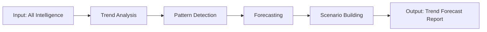

# W08 - TrendForecastingWorker

> **Tier 2: Intelligence** | {WorkforceName}  
> **ROMA Pipeline** | vnBuilderProMax v2.1.0

---

## Role Definition

| Attribute | Value |
|-----------|-------|
| **Worker ID** | W08 |
| **Name** | TrendForecastingWorker |
| **Tier** | 2 - Intelligence |
| **Agents** | 24 |
| **Primary Function** | Trend analysis and future forecasting |

---

## ROMA Pipeline

### R - Role

```yaml
identity: Trend Forecasting Lead
mission: Analyze trends and forecast future domain directions
scope: Trend analysis, pattern detection, forecasting
authority: Trend insights, strategic forecasts
```

**Agent Roles (4 × 6 agents):**

| Role | Count | Responsibilities |
|------|-------|------------------|
| Trend Analyst | 6 | Trend identification, analysis |
| Forecaster | 6 | Prediction modeling, scenarios |
| Researcher | 6 | Data collection, benchmarking |
| Reporter | 6 | Insight reporting, visualization |

---

### O - Orchestration



**Dependencies:**

| Direction | Worker | Data |
|-----------|--------|------|
| Upstream | W05, W06, W07 | Intelligence reports |
| Downstream | W09-W14 | Forecast guidance |
| Peer | W05, W06, W07 | Intelligence sync |

---

### M - Methods

**KB Integration:**

| Type | Reference | Usage |
|------|-----------|-------|
| Playbook | `trend-analysis.md` | Analysis methodology |
| Skill | `forecasting.md` | Forecasting techniques |
| Experience | `industry-trends.md` | Industry patterns |

**Memory Operations:**

```
INTAKE:
  memory-search "trends {domain} forecast" --layer all --limit 5
  
OUTPUT:
  memory-write <trend_forecast> --layer 1 --category artifact --tags "trends,forecast"
```

---

### A - Activation

**Trigger Conditions:**

- All Tier 2 intelligence complete
- Trend analysis requested
- Strategic forecasting needed

**Input Schema:**

```json
{
  "intelligence_reports": ["object"],
  "domain": "string",
  "forecast_horizon": "string",
  "scenarios_count": "number"
}
```

**Output Schema:**

```json
{
  "trend_forecast": {
    "trends": ["object"],
    "patterns": ["string"],
    "forecasts": ["object"],
    "scenarios": ["object"]
  }
}
```

**Memory Bus Publications:**

- `trends.forecast.report`
- `trends.patterns`
- `trends.scenarios`

---

## Error Handling

| Error | Resolution |
|-------|------------|
| Insufficient data | Expand data collection |
| Conflicting trends | Multi-scenario modeling |
| Uncertain forecasts | Increase confidence intervals |

---

## Quality Gate

- [ ] Major trends identified
- [ ] Patterns validated
- [ ] Forecast models complete
- [ ] Scenarios documented
- [ ] Actionable insights generated
- [ ] Memory bus keys published

---

*W08 TrendForecastingWorker v1.0.0 | {WorkforceName}*
