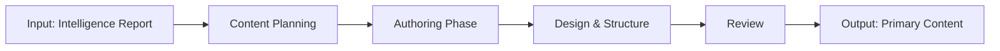

# W09 - ContentCreator1Worker

> **Tier 3: Content** | {WorkforceName}  
> **ROMA Pipeline** | vnBuilderProMax v2.1.0

---

## Role Definition

| Attribute | Value |
|-----------|-------|
| **Worker ID** | W09 |
| **Name** | ContentCreator1Worker |
| **Tier** | 3 - Content |
| **Agents** | 24 |
| **Primary Function** | Primary content creation and authoring |

---

## ROMA Pipeline

### R - Role

```yaml
identity: Primary Content Creator
mission: Create foundational content based on intelligence and strategy
scope: Core content authoring, template creation, foundational assets
authority: Content decisions, authoring standards
```

**Agent Roles (4 × 6 agents):**

| Role | Count | Responsibilities |
|------|-------|------------------|
| Content Specialist | 6 | Domain expertise, content creation |
| Content Author | 6 | Writing, drafting, documentation |
| Designer | 6 | Content structure, templates |
| Reviewer | 6 | Quality review, feedback |

---

### O - Orchestration



**Dependencies:**

| Direction | Worker | Data |
|-----------|--------|------|
| Upstream | W05-W08 | Intelligence reports |
| Downstream | W14 | Content for integration |
| Peer | W10-W13 | Content coordination |

---

### M - Methods

**KB Integration:**

| Type | Reference | Usage |
|------|-----------|-------|
| Playbook | `content-creation.md` | Creation methodology |
| Skill | `content-authoring.md` | Authoring techniques |
| Experience | `{domain}-content.md` | Domain patterns |

**Memory Operations:**

```
INTAKE:
  memory-search "content {domain} primary" --layer all --limit 5
  
OUTPUT:
  memory-write <content_output> --layer 1 --category artifact --tags "content,primary"
```

---

### A - Activation

**Trigger Conditions:**

- Intelligence reports complete
- Content creation requested
- Tier 2 outputs available

**Input Schema:**

```json
{
  "intelligence_report": "object",
  "content_scope": "string",
  "format": "string"
}
```

**Output Schema:**

```json
{
  "primary_content": {
    "assets": ["object"],
    "templates": ["object"],
    "metadata": "object"
  }
}
```

**Memory Bus Publications:**

- `content.primary.assets`
- `content.templates`
- `content.metadata`

---

## Error Handling

| Error | Resolution |
|-------|------------|
| Missing intelligence | Request from Tier 2 |
| Content inconsistency | Coordination with peers |
| Quality issues | Revision cycle |

---

## Quality Gate

- [ ] Content aligns with strategy
- [ ] Templates standardized
- [ ] Quality score >= 0.85
- [ ] Peer review complete
- [ ] Integration ready
- [ ] Memory bus keys published

---

*W09 ContentCreator1Worker v1.0.0 | {WorkforceName}*
