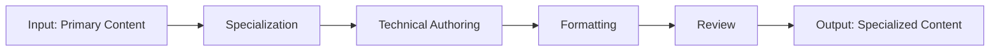

# W10 - ContentCreator2Worker

> **Tier 3: Content** | {WorkforceName}  
> **ROMA Pipeline** | vnBuilderProMax v2.1.0

---

## Role Definition

| Attribute | Value |
|-----------|-------|
| **Worker ID** | W10 |
| **Name** | ContentCreator2Worker |
| **Tier** | 3 - Content |
| **Agents** | 24 |
| **Primary Function** | Secondary content creation and specialization |

---

## ROMA Pipeline

### R - Role

```yaml
identity: Secondary Content Creator
mission: Create specialized content for specific domain areas
scope: Specialized authoring, domain-specific assets
authority: Specialized content decisions
```

**Agent Roles (4 × 6 agents):**

| Role | Count | Responsibilities |
|------|-------|------------------|
| Domain Specialist | 6 | Specialized expertise |
| Content Author | 6 | Technical writing |
| Designer | 6 | Specialized templates |
| Reviewer | 6 | Technical review |

---

### O - Orchestration



**Dependencies:**

| Direction | Worker | Data |
|-----------|--------|------|
| Upstream | W09 | Primary content |
| Downstream | W14 | Content for integration |
| Peer | W09, W11-W13 | Content coordination |

---

### M - Methods

**KB Integration:**

| Type | Reference | Usage |
|------|-----------|-------|
| Playbook | `specialized-content.md` | Specialization methodology |
| Skill | `technical-writing.md` | Technical authoring |
| Experience | `{area}-content.md` | Area patterns |

**Memory Operations:**

```
INTAKE:
  memory-search "content {area} specialized" --layer all --limit 5
  
OUTPUT:
  memory-write <specialized_content> --layer 1 --category artifact --tags "content,specialized"
```

---

### A - Activation

**Trigger Conditions:**

- Primary content available
- Specialization requested
- Technical content needed

**Input Schema:**

```json
{
  "primary_content": "object",
  "specialization": "string",
  "technical_level": "string"
}
```

**Output Schema:**

```json
{
  "specialized_content": {
    "assets": ["object"],
    "technical_docs": ["object"],
    "specifications": "object"
  }
}
```

**Memory Bus Publications:**

- `content.specialized.assets`
- `content.technical.docs`
- `content.specifications`

---

## Error Handling

| Error | Resolution |
|-------|------------|
| Missing primary content | Wait for W09 |
| Technical inaccuracy | Expert review |
| Format issues | Template revision |

---

## Quality Gate

- [ ] Technical accuracy verified
- [ ] Specialization complete
- [ ] Quality score >= 0.85
- [ ] Peer review complete
- [ ] Integration ready
- [ ] Memory bus keys published

---

*W10 ContentCreator2Worker v1.0.0 | {WorkforceName}*
