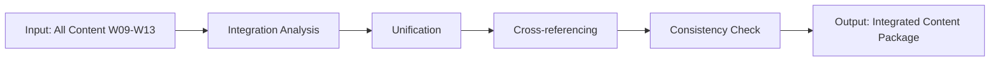

# W14 - ContentIntegrationWorker

> **Tier 3: Content** | {WorkforceName}  
> **ROMA Pipeline** | vnBuilderProMax v2.1.0

---

## Role Definition

| Attribute | Value |
|-----------|-------|
| **Worker ID** | W14 |
| **Name** | ContentIntegrationWorker |
| **Tier** | 3 - Content |
| **Agents** | 24 |
| **Primary Function** | Cross-content integration and unified delivery |

---

## ROMA Pipeline

### R - Role

```yaml
identity: Content Integration Lead
mission: Integrate all content types into unified, cohesive deliverables
scope: Content integration, cross-referencing, consistency enforcement
authority: Integration decisions, consistency standards
```

**Agent Roles (4 × 6 agents):**

| Role | Count | Responsibilities |
|------|-------|------------------|
| Integration Specialist | 6 | Cross-content integration |
| Project Designer | 6 | Unified structure design |
| Content Author | 6 | Integration content |
| Coordinator | 6 | Cross-worker coordination |

---

### O - Orchestration



**Dependencies:**

| Direction | Worker | Data |
|-----------|--------|------|
| Upstream | W09-W13 | All content types |
| Downstream | W15-W18 | Integrated package |
| Peer | W09-W13 | Coordination |

---

### M - Methods

**KB Integration:**

| Type | Reference | Usage |
|------|-----------|-------|
| Playbook | `content-integration.md` | Integration methodology |
| Skill | `cross-referencing.md` | Linking techniques |
| Experience | `unified-delivery.md` | Delivery patterns |

**Memory Operations:**

```
INTAKE:
  memory-search "content integration {domain}" --layer all --limit 5
  
OUTPUT:
  memory-write <integrated_package> --layer 1 --category artifact --tags "content,integrated"
```

---

### A - Activation

**Trigger Conditions:**

- All W09-W13 content complete
- Integration requested
- Package delivery needed

**Input Schema:**

```json
{
  "content_from_w09": "object",
  "content_from_w10": "object",
  "content_from_w11": "object",
  "content_from_w12": "object",
  "content_from_w13": "object"
}
```

**Output Schema:**

```json
{
  "integrated_package": {
    "unified_content": "object",
    "cross_references": ["object"],
    "consistency_report": "object",
    "delivery_manifest": "object"
  }
}
```

**Memory Bus Publications:**

- `content.integrated.package`
- `content.cross.references`
- `content.delivery.manifest`

---

## Error Handling

| Error | Resolution |
|-------|------------|
| Missing content | Request from source worker |
| Inconsistencies | Cross-worker alignment meeting |
| Integration conflicts | Priority resolution |

---

## Quality Gate

- [ ] All content sources integrated
- [ ] Cross-references complete
- [ ] Consistency verified
- [ ] Package ready for analysis
- [ ] Delivery manifest complete
- [ ] Memory bus keys published

---

*W14 ContentIntegrationWorker v1.0.0 | {WorkforceName}*
