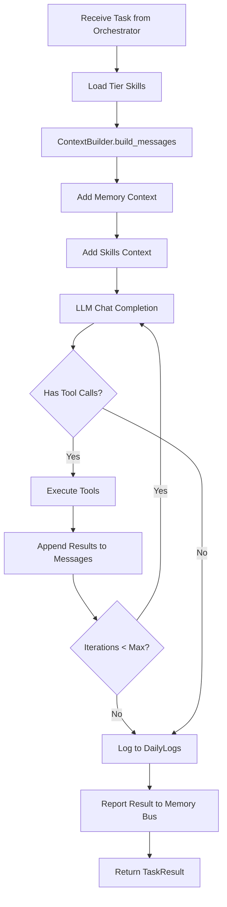

# AgentLoop - Core Processing Engine

> **Module Documentation**: vnBuilderPro-MAS2026 CoreModules
>
> The heart of worker execution - orchestrates message processing, LLM calls, and tool execution.

---

## 📋 Overview

| Attribute | Value |
|-----------|-------|
| **Source** | nanobot `agent/loop.py` pattern |
| **Dependencies** | ContextBuilder, MemoryStore, SkillsLoader, SubagentManager |
| **Max Iterations** | 20 per task |
| **Integration** | 22 Workers across 8 tiers |

---

## 🏗️ Class Structure

```python
class AgentLoop:
    """
    The agent loop is the core processing engine for each worker.
    
    It:
    1. Receives tasks from the tier orchestrator
    2. Builds context with history, memory, skills
    3. Calls the LLM
    4. Executes tool calls
    5. Reports results to Memory Bus
    """
    
    def __init__(
        self,
        worker_id: str,
        tier: int,
        workspace: Path,
        model: str | None = None,
        max_iterations: int = 20,
    ):
        self.worker_id = worker_id
        self.tier = tier
        self.workspace = workspace
        self.model = model or "claude-sonnet-4-20250514"
        self.max_iterations = max_iterations
        
        # Initialize components
        self.context = ContextBuilder(workspace)
        self.memory = MemoryStore(workspace)
        self.skills = SkillsLoader(workspace)
        self.tools = ToolRegistry()
        self._running = False
```

---

## 🔧 Constructor Parameters

| Parameter | Type | Default | Description |
|-----------|------|---------|-------------|
| `worker_id` | `str` | Required | Worker identifier (e.g., "W01", "W15") |
| `tier` | `int` | Required | Worker tier (1-8) |
| `workspace` | `Path` | Required | Workforce directory path |
| `model` | `str` | `None` | Override default LLM model |
| `max_iterations` | `int` | `20` | Max tool execution iterations |

---

## 📚 Methods

### `run() -> None`

Run the agent loop, processing tasks from the tier orchestrator.

```python
async def run(self):
    """Run the agent loop, processing tasks from the tier orchestrator."""
    self._running = True
    logger.info(f"Worker {self.worker_id} (Tier {self.tier}) started")
    
    while self._running:
        try:
            task = await self._get_next_task()
            if task:
                result = await self._process_task(task)
                await self._report_result(result)
        except Exception as e:
            logger.error(f"Worker {self.worker_id} error: {e}")
            await self._handle_error(e)
```

### `stop() -> None`

Stop the agent loop gracefully.

```python
async def stop(self):
    """Stop the agent loop."""
    self._running = False
    logger.info(f"Worker {self.worker_id} stopped")
```

### `_process_task(task: Task) -> TaskResult`

Process a single task from the tier orchestrator.

**Flow:**

1. Load tier-specific skills
2. Build context with ContextBuilder
3. Call LLM with tools
4. Execute tool calls in a loop
5. Log to DailyLogs
6. Return result

```python
async def _process_task(self, task: Task) -> TaskResult:
    """Process a single task."""
    # Load tier-specific skills
    tier_skills = self.skills.get_tier_skills(self.tier)
    
    # Build context
    messages = self.context.build_messages(
        history=task.history,
        current_message=task.prompt,
        skill_names=tier_skills
    )
    
    # LLM loop with tool execution
    for iteration in range(self.max_iterations):
        response = await self._call_llm(messages)
        
        if not response.tool_calls:
            break
        
        # Execute tools and append results
        for call in response.tool_calls:
            result = await self.tools.execute(call.name, call.arguments)
            messages = self.context.add_tool_result(
                messages, call.id, call.name, result
            )
            messages = self.context.add_assistant_message(
                messages, None, [call]
            )
    
    # Log to DailyLogs
    await self._log_completion(task, response)
    
    return TaskResult(
        worker_id=self.worker_id,
        task_id=task.id,
        content=response.content,
        status="completed"
    )
```

### `process_direct(content: str, session_key: str) -> str`

Process a message directly (for CLI/testing).

```python
async def process_direct(self, content: str, session_key: str = "direct") -> str:
    """
    Process a message directly (for CLI/testing).
    
    Args:
        content: The message content.
        session_key: Session identifier.
    
    Returns:
        The worker's response.
    """
    task = Task(
        id=f"{self.worker_id}:{session_key}",
        prompt=content,
        history=[]
    )
    result = await self._process_task(task)
    return result.content
```

---

## 🔧 Tool Registration

### `_register_default_tools() -> None`

Register the default set of tools for workers.

```python
def _register_default_tools(self):
    """Register the default set of tools."""
    # Filesystem tools
    self.tools.register(ReadFileTool())
    self.tools.register(WriteFileTool())
    self.tools.register(ListDirTool())
    
    # Shell execution
    self.tools.register(ExecTool())
    
    # Web tools
    self.tools.register(WebSearchTool())
    self.tools.register(WebFetchTool())
    
    # Memory Bus
    self.tools.register(MemoryBusWriteTool(self.memory))
    self.tools.register(MemoryBusReadTool(self.memory))
    
    # Subagent spawning (for parallel execution)
    self.tools.register(SpawnTool(self.subagents))
```

---

## 🔄 Processing Flow



---

## 💡 Key Features

### 1. **Iterative Tool Execution**

Workers can execute up to 20 tool calls in a single task, enabling complex multi-step operations.

### 2. **Tier-Aware Skill Loading**

Each tier automatically loads relevant skills:

| Tier | Skills Loaded |
|------|---------------|
| 1 | Research, pattern-analysis |
| 2 | Requirements-parsing, mapping |
| 3 | Architecture, swarm-selection |
| 4 | Playbook-generation, KB-design |
| 5 | Agent-specs, prompt-engineering |
| 6 | Orchestration, memory-contracts |
| 7 | Quality-gates, validation |
| 8 | Deployment, evolution |

### 3. **Session Persistence**

Task history is maintained per worker session in Memory Bus.

### 4. **Auto-Logging**

All task completions are logged to DailyLogs:

```python
async def _log_completion(self, task: Task, response: Response):
    """Log task completion to DailyLogs."""
    log_entry = f"""
## [{self.worker_id}] Task: {task.id}
- **Time**: {datetime.now().isoformat()}
- **Status**: Completed
- **Iterations**: {self._iteration_count}
- **Summary**: {response.content[:200]}...
"""
    self.memory.append_today(log_entry)
```

### 5. **Error Handling**

Robust error handling with automatic recovery:

```python
async def _handle_error(self, error: Exception):
    """Handle worker errors with logging and recovery."""
    error_entry = f"""
## [{self.worker_id}] ERROR
- **Time**: {datetime.now().isoformat()}
- **Error**: {str(error)}
- **Recovery**: Attempting retry...
"""
    self.memory.append_today(error_entry)
    
    # Trigger recovery protocol
    if self._retry_count < 3:
        self._retry_count += 1
        await asyncio.sleep(1)
    else:
        await self._escalate_to_tier_lead()
```

---

## 📝 Usage Example

```python
from vnbuilder.core import AgentLoop
from pathlib import Path

# Initialize worker
workspace = Path("D:/BuilderPro/_vnBuilderPro-MAS2026")
worker = AgentLoop(
    worker_id="W06",
    tier=3,
    workspace=workspace,
    model="claude-sonnet-4-20250514"
)

# Run (async)
await worker.run()

# Or process directly
response = await worker.process_direct(
    "Design a HierarchicalSwarm topology for 8 workers"
)
```

---

## 📊 Tier Integration

| Tier | Workers | AgentLoop Configuration |
|------|---------|------------------------|
| 1 | W01-W03 | Research-focused, web tools enabled |
| 2 | W04-W05 | Requirements parsing, schema tools |
| 3 | W06-W09 | Architecture design, pattern tools |
| 4 | W10-W11 | Knowledge generation, KB tools |
| 5 | W12-W14 | Agent engineering, prompt tools |
| 6 | W15-W17 | Integration, orchestration tools |
| 7 | W18-W19 | Validation, quality gate tools |
| 8 | W20-W22 | Deployment, evolution tools |

---

## 🔗 Related Modules

| Module | Relationship |
|--------|--------------|
| [ContextBuilder](context-builder.md) | Builds system prompt and messages |
| [MemoryStore](memory-store.md) | Persistent memory access |
| [SkillsLoader](skills-loader.md) | Skills management |
| [SubagentManager](subagent-manager.md) | Background task execution |

---

*vnBuilderPro-MAS2026 CoreModules | AgentLoop v2.3.0 | Nanobot Pattern*
