# 📘 Hướng Dẫn Sử Dụng: SEO-AEO-GEO-EEAT-BlogWriter

> **vnBuilderProMax v2.3.4** | 528-Agent HierarchicalSwarm | L5 Full Autonomy | KB Integration

---

## 📑 Mục Lục

1. [Tổng Quan](#1-tổng-quan)
2. [Kiến Trúc Hệ Thống](#2-kiến-trúc-hệ-thống)
3. [Quy Trình Làm Việc](#3-quy-trình-làm-việc-9-phase-pipeline)
4. [Playbooks - Quy Trình Nghiệp Vụ](#4-playbooks---quy-trình-nghiệp-vụ)
5. [Skills - Kỹ Năng Kỹ Thuật](#5-skills---kỹ-năng-kỹ-thuật)
6. [Workers - Danh Sách Thành Viên](#6-workers---danh-sách-thành-viên)
7. [Hệ Thống Bộ Nhớ](#7-hệ-thống-bộ-nhớ-clawdbot-v232)
8. [Autonomous-Core (L5)](#8-autonomous-core-l5-10-files)
9. [🆕 Knowledge-Base Integration](#9-knowledge-base-integration-v234)
10. [🆕 Learning Pipeline](#10-learning-pipeline-outputs-experience)
11. [Cú Pháp Đầu Vào](#11-cú-pháp-đầu-vào)
12. [Đầu Ra Chuẩn](#12-đầu-ra-chuẩn---7-deliverables)
13. [10 Ví Dụ Thực Tế](#13-10-ví-dụ-thực-tế)

---

## 1. Tổng Quan

**SEO-AEO-GEO-EEAT-BlogWriter** là workforce tự động hóa hoàn toàn việc tạo nội dung blog chuyên nghiệp, được tối ưu hóa cho các tiêu chuẩn tìm kiếm 2025-2026 bao gồm:

| Thuật Ngữ | Giải Thích |
| :--- | :--- |
| **SEO** | Search Engine Optimization - Tối ưu công cụ tìm kiếm |
| **AEO** | Answer Engine Optimization - Tối ưu cho trích xuất câu trả lời |
| **GEO** | Generative Engine Optimization - Tối ưu cho AI/LLM citation |
| **E-E-A-T** | Experience, Expertise, Authoritativeness, Trustworthiness |

### Thông Số Kỹ Thuật

| Thành Phần | Số Lượng |
| :--- | :--- |
| **Tiers (Tầng)** | 6 |
| **Workers (Thành viên)** | 22 |
| **Agents/Worker** | 24 |
| **Tổng Agents** | 528 |
| **Autonomy Level** | L5 Full Auto |

### Đặc Điểm Nổi Bật

- ✅ **Human-First Voice**: Giọng văn tự nhiên như người viết thực
- ✅ **AI Overview Ready**: Nội dung sẵn sàng được trích dẫn bởi AI
- ✅ **Voice Search Optimized**: Tối ưu cho tìm kiếm bằng giọng nói
- ✅ **Google Helpful Content**: Tuân thủ 100% tiêu chuẩn nội dung hữu ích
- ✅ **Auto-Save Outputs**: Tự động lưu kết quả vào thư mục đầu ra
- ✅ **Context Persistence**: Lưu trữ ngữ cảnh giữa các phiên làm việc
- ✅ **Self-Learning**: Cơ chế học tự động từ kết quả thực thi
- 🆕 **Knowledge-Base Integration**: 8 PB + 10 SK + Auto-growing EXPERIENCE
- 🆕 **Learning Pipeline**: Outputs → EXPERIENCE tự động

---

## 2. Kiến Trúc Hệ Thống

### 2.1 Sơ Đồ Tổng Quan

```mermaid
flowchart TB
    subgraph T1["Tier 1: Strategy"]
        W01[W01: ContentStrategyResearch]
        W02[W02: SEOAEOGEOPlanning]
        W03[W03: EEATStandardsAlignment]
        W04[W04: IntegrationStrategy]
    end
    
    subgraph T2["Tier 2: Intelligence ⚡"]
        W05[W05: KeywordEntityIntelligence]
        W06[W06: CompetitorAnalysis]
        W07[W07: SearchIntentClassification]
        W08[W08: TrendForecasting]
    end
    
    subgraph T3["Tier 3: Content ⚡"]
        W09[W09: ContentOutline]
        W10[W10: HumanFirstCopywriter]
        W11[W11: SEOOptimization]
        W12[W12: AEOGEOEnhancement]
        W13[W13: VisualStructuredData]
        W14[W14: ContentIntegration]
    end
    
    subgraph T4["Tier 4: Analysis ⚡"]
        W15[W15: ReadabilityVoiceAnalyzer]
        W16[W16: EEATComplianceMapper]
        W17[W17: Personalization]
        W18[W18: ProgressTracking]
    end
    
    subgraph T5["Tier 5: Validation"]
        W19[W19: QualityAssurance]
        W20[W20: ComplianceValidation]
    end
    
    subgraph T6["Tier 6: Synthesis"]
        W21[W21: FinalDeliverablesGenerator]
        W22[W22: Certification]
    end
    
    T1 --> T2 --> T3 --> T4 --> T5 --> T6
```



### 2.2 Luồng Thực Thi

```text
T1 Strategy (4)     → T2 Intelligence (4) ⚡ → T3 Content (6) ⚡
                                                ↓
T6 Synthesis (2)  ← T5 Validation (2)    ← T4 Analysis (4) ⚡
```

> **Ghi chú**: ⚡ = Thực thi song song (Parallel Execution)

---

## 3. Quy Trình Làm Việc (9-Phase Pipeline)

### 3.1 Tổng Quan Pipeline

| Phase | Tên | Tier | Mode | Thời Gian |
| :--- | :--- | :--- | :--- | :--- |
| P0 | Bootstrap Context Injection | - | Auto | ~1 min |
| P1 | Strategic Planning | T1 | Sequential | ~10 min |
| P2 | Intelligence Gathering | T2 | ⚡ Parallel | ~15 min |
| P3 | Content Development | T3 | Mixed | ~30 min |
| P4 | Analysis & Personalization | T4 | ⚡ Parallel | ~15 min |
| P5 | Quality Validation | T5 | Sequential | ~10 min |
| P6 | Reporting & Synthesis | T6 | Sequential | ~10 min |
| P7 | Memory Logging | - | Auto | ~1 min |
| **P8** | **🆕 Learning Pipeline** | - | Auto | ~2 min |

### 3.2 Chi Tiết Từng Phase

#### Phase 0: Bootstrap Context Injection

1. Load Context-Layer bootstrap files
2. Initialize MemoryStore + SkillsLoader
3. Inject tier-specific context per worker
4. Validate configurations loaded

#### Phase 1: Strategic Planning (T1)

- **W01**: Phân tích topic, audience, intent
- **W02**: Xác định chiến lược keyword/entity
- **W03**: Thiết lập framework E-E-A-T
- **W04**: Lập kế hoạch tích hợp nội dung

#### Phase 2: Intelligence Gathering (T2) ⚡

- **W05**: Deep keyword research
- **W06**: Phân tích đối thủ
- **W07**: Phân loại search intent
- **W08**: Xác định trends, PAA questions

#### Phase 3: Content Development (T3)

- **W09-W13**: Parallel drafting
- **W14 (Aggregator)**: Tổng hợp tất cả content components

#### Phase 4: Analysis & Personalization (T4) ⚡

- **W15**: Kiểm tra readability, tone
- **W16**: Audit E-E-A-T signals
- **W17**: Personalize cho target audience
- **W18**: Track tiến độ

#### Phase 5: Quality Validation (T5)

- **W19**: Full quality audit
- **W20**: Compliance verification

#### Phase 6: Reporting & Synthesis (T6)

- **W21**: Generate 7 final deliverables
- **W22**: Certification và memory commit

#### Phase 7: Memory Logging

1. Generate execution log
2. Update MEMORY.md with patterns
3. Commit to daily log
4. Index new entries

#### Phase 8: Learning Pipeline (🆕 v2.3.4)

1. Check quality score (≥ 90 threshold)
2. Extract patterns: structure, SEO, EEAT, voice
3. Calculate novelty vs existing EXPERIENCE
4. Generate EXP-XXX.md file
5. Auto-index in knowledge-base-index.json

### 3.3 Chế Độ Thực Thi

| Mode | Thời Gian | Use Case |
| :--- | :--- | :--- |
| **Quick** | ~45 min | Blog ngắn, FAQ, nội dung đơn giản |
| **Standard** | ~75 min | Blog chuẩn, hướng dẫn, so sánh |
| **Enterprise** | ~120 min | YMYL, legal content, full E-E-A-T |

---

## 4. Playbooks - Quy Trình Nghiệp Vụ

| # | Playbook | Mục Đích |
| :--- | :--- | :--- |
| **PB-001** | Content Brief Protocol | Xử lý và validate input parameters |
| **PB-002** | E-E-A-T Compliance Checklist | Đảm bảo 4 yếu tố E-E-A-T |
| **PB-003** | Featured Snippet Protocol | Tối ưu cho Paragraph/List/Table snippets |
| **PB-004** | PAA Research Protocol | Nghiên cứu và format People Also Ask |
| **PB-005** | AEO Enhancement Protocol | Voice search & AI extraction ready |
| **PB-006** | GEO Entity Protocol | Entity consistency & brand mentions |
| **PB-007** | JSON-LD Generation Protocol | Article, FAQPage, LegalService schemas |
| **PB-008** | Human-First Voice Protocol | Texas professional voice standards |

### Chi Tiết PB-002: E-E-A-T Compliance Checklist

| Yếu Tố | Signals |
| :--- | :--- |
| **Experience** | Real scenarios, mini case study, "In my experience..." |
| **Expertise** | Technical accuracy, domain vocabulary, comprehensive depth |
| **Authoritativeness** | Author bio, expert reviewer, 2-4 citations (.gov, .edu) |
| **Trustworthiness** | Disclaimers, "Last updated" date, jurisdiction notes |

---

## 5. Skills - Kỹ Năng Kỹ Thuật

| # | Skill | Chức Năng |
| :--- | :--- | :--- |
| **SK-001** | Keyword & Entity Research | Extract/validate keywords và entity clusters |
| **SK-002** | Competitor Content Analysis | Gap analysis và differentiation |
| **SK-003** | Search Intent Classification | Buyer journey mapping |
| **SK-004** | Human-First Copywriting | Texas voice, Grade 7-9 readability |
| **SK-005** | SEO On-Page Optimization | Meta pack, linking strategy |
| **SK-006** | AEO Answer Formatting | 40-60 word extractable answers |
| **SK-007** | GEO Entity Optimization | NAP consistency, brand mentions |
| **SK-008** | Structured Data Generation | Valid JSON-LD với @graph |
| **SK-009** | Readability Analysis | Flesch-Kincaid, active voice audit |
| **SK-010** | E-E-A-T Audit | Compliance scoring (≥85 YMYL, ≥70 general) |

---

## 6. Workers - Danh Sách Thành Viên

### Tier 1: Strategy (4 Workers)

| Worker | Vai Trò |
| :--- | :--- |
| **W01: ContentStrategyResearch** | Phân tích requests, research topic depth |
| **W02: SEOAEOGEOPlanning** | Định nghĩa keyword strategy, AEO points |
| **W03: EEATStandardsAlignment** | YMYL classification, citation benchmarks |
| **W04: IntegrationStrategy** | Synthesize strategy outputs |

### Tier 2: Intelligence (4 Workers)

| Worker | Vai Trò |
| :--- | :--- |
| **W05: KeywordEntityIntelligence** | Validate metrics, entity relationship maps |
| **W06: CompetitorAnalysis** | Audit competitor structure, identify gaps |
| **W07: SearchIntentClassification** | Map queries to buyer journey stages |
| **W08: TrendForecasting** | Extract PAA questions, seasonal angles |

### Tier 3: Content Creation (6 Workers)

| Worker | Vai Trò |
| :--- | :--- |
| **W09: ContentOutline** | H1-H3 hierarchy với PAA questions |
| **W10: HumanFirstCopywriter** | Primary narrative, Texas professional voice |
| **W11: SEOOptimization** | Meta packs, slugs, link maps |
| **W12: AEOGEOEnhancement** | Extractive answers, brand naming |
| **W13: VisualStructuredData** | JSON-LD, visual asset plans |
| **W14: ContentIntegration** | **Aggregator** - Sync Tier 3 outputs |

### Tier 4: Analysis (4 Workers)

| Worker | Vai Trò |
| :--- | :--- |
| **W15: ReadabilityVoiceAnalyzer** | Flesch-Kincaid, active voice, tone |
| **W16: EEATComplianceMapper** | Score E-E-A-T benchmarks |
| **W17: Personalization** | Audience fit, localization (Houston) |
| **W18: ProgressTracking** | Deliverable completion monitoring |

### Tier 5: Validation (2 Workers)

| Worker | Vai Trò |
| :--- | :--- |
| **W19: QualityAssurance** | Comprehensive quality audit |
| **W20: ComplianceValidation** | E-E-A-T certification, schema validity |

### Tier 6: Synthesis (2 Workers)

| Worker | Vai Trò |
| :--- | :--- |
| **W21: FinalDeliverablesGenerator** | Assemble 7 canonical deliverables |
| **W22: Certification** | Final certification + CLAWDBOT commit |

---

## 7. Hệ Thống Bộ Nhớ (CLAWDBOT v2.3.2)

### 7.1 Kiến Trúc 3 Lớp

```text
Context-Layer/Second-Brain/Memory/
├── DailyLogs/              # Layer 1: Ephemeral (30-day retention)
│   └── 2026-02-05.md
├── ExecutionLogs/          # Layer 1.5: Execution records
│   └── 2026-02-05-HHMMSS.json
├── Patterns/               # Layer 2: Learned patterns
│   └── success-patterns.md
└── MEMORY.md               # Layer 3: Curated (Permanent)
```

| Layer | Mục Đích | Retention |
| :--- | :--- | :--- |
| **Layer 1** | Session logs, raw execution data | 30 ngày |
| **Layer 1.5** | Execution context snapshots | 90 ngày |
| **Layer 2** | Extracted patterns | Vĩnh viễn |
| **Layer 3** | Best practices, learned optimizations | Vĩnh viễn |

### 7.2 Memory Commands

| Command | Chức Năng |
| :--- | :--- |
| `/memory-write` | Ghi pattern mới vào MEMORY.md |
| `/memory-get` | Truy xuất memory entry cụ thể |
| `/memory-search` | Tìm kiếm trong memory store |
| `/list-memory` | Liệt kê tất cả memory entries |
| `/recall` | Recall context từ previous sessions |
| `/compact` | Compact và deduplicate memory |
| `/save-context --full` | Lưu toàn bộ execution context |

---

## 8. Autonomous-Core (L5 - 10 Files)

### 8.1 Thành Phần Chính

| Component | Chức Năng |
| :--- | :--- |
| **orchestrator.md** | Điều phối 9-phase pipeline |
| **goal-manager.md** | Quản lý mục tiêu và milestones |
| **decision-engine.md** | Ra quyết định tự động |
| **execution-monitor.md** | Theo dõi thực thi real-time |
| **error-recovery.md** | Xử lý lỗi tự động |
| **output-saver.md** | Tự động lưu kết quả |
| **context-persistence.md** | Lưu trữ ngữ cảnh |
| **pattern-extractor.md** | Trích xuất patterns |
| **self-improvement-loop.md** | Tối ưu liên tục |
| **outputs-learner.md** | 🆕 Outputs → EXPERIENCE |

### 8.2 L5 Optimization Suite

```text
Autonomous-Core/
├── orchestrator.md           # Central control
├── goal-manager.md           # Goal tracking
├── decision-engine.md        # Decision logic
├── execution-monitor.md      # Execution tracking
├── error-recovery.md         # Error handling
├── output-saver.md           # Auto-save outputs
├── context-persistence.md    # Context save/restore
├── pattern-extractor.md      # Pattern extraction
├── self-improvement-loop.md  # A/B testing
└── outputs-learner.md        # 🆕 Learning pipeline
```

### 8.3 Tính Năng L5

- **Auto-Save**: Tự động lưu 7 deliverables vào `Outputs/`
- **Context Persistence**: Snapshot execution state
- **Self-Learning**: Extract patterns từ executions thành công
- **🆕 Learning Pipeline**: Outputs chất lượng cao → EXPERIENCE

---

## 9. Knowledge-Base Integration (v2.3.4)

### 9.1 Cấu Trúc Knowledge-Base

```text
Context-Layer/Knowledge-Base/
├── PLAYBOOKS/                  # 8 protocol files (PB-XXX)
├── SKILLS/                     # 10 skill files (SK-XXX)
├── EXPERIENCE/                 # Auto-growing (EXP-XXX)
├── knowledge-base-index.json  # Auto-discovery index
├── knowledge-loader.md        # Worker loading guide
└── README.md
```

### 9.2 Worker KB Access

| Tier | PLAYBOOKS | SKILLS | EXPERIENCE |
| :--- | :--- | :--- | :--- |
| T1 Strategy | PB-001, 002, 008 | SK-001, 003 | ❌ |
| T2 Intelligence | PB-001, 004 | SK-001, 002, 003 | ❌ |
| T3 Content | PB-003, 005-008 | SK-004 to 008 | ✅ Read All |
| T4 Analysis | PB-002, 008 | SK-009, 010 | ❌ |
| T5 Validation | PB-002 | SK-010 | ❌ |
| T6 Synthesis | PB-007 | SK-008 | ✅ Read/Write |

---

## 10. Learning Pipeline (Outputs → EXPERIENCE)

### 10.1 Luồng Hoạt Động

```
Outputs/[topic]/ → quality ≥ 90 → pattern-extractor → outputs-learner
                                                              ↓
                                            Knowledge-Base/EXPERIENCE/EXP-XXX.md
                                                              ↓
                                                    Tier3 Workers READ
```

### 10.2 Pattern Categories

| Category | Mô Tả |
| :--- | :--- |
| **structure** | H1/H2/H3 hierarchy, section flow |
| **seo** | Keyword placement, meta patterns |
| **eeat** | Expert citations, trust signals |
| **aeo** | Featured snippet format, PAA |
| **voice** | Tone patterns, engagement style |
| **domain** | Industry-specific terminology |

---

## 11. Cú Pháp Đầu Vào

### 11.1 Minimal Input (Quick Mode)

```yaml
Topic: How to Form an LLC in Texas
Primary Keyword: form llc texas
```

### 11.2 Standard Input

```yaml
Topic: How to Form an LLC in Texas
Primary Keyword: form llc texas
Secondary Keywords:
  - texas llc formation
  - llc filing texas
  - start llc houston
Search Intent: informational
Audience: Houston small business owners
```

### 11.3 Full Input (Enterprise Mode)

```yaml
Topic: How to Form an LLC in Texas
Primary Keyword: form llc texas
Secondary Keywords:
  - texas llc formation
  - llc filing texas
  - start llc houston
  - texas llc requirements
  - llc operating agreement texas
Search Intent: informational
Audience: Houston small business owners
Stage: consideration
Primary CTA: Free Consultation
Competitors:
  - competitor1.com
  - competitor2.com
YMYL: true
Expert Reviewer: Attorney Name, Texas Bar #12345
Locale: Houston, TX
```

### 11.4 Tham Số Chi Tiết

| Tham Số | Bắt Buộc | Mô Tả |
| :--- | :--- | :--- |
| `Topic` | ✅ | Chủ đề chính của bài viết |
| `Primary Keyword` | ✅ | Keyword mục tiêu cho H1/meta |
| `Secondary Keywords` | ✅ | 5-12 supporting keywords |
| `Search Intent` | ✅ | Informational/Commercial/Transactional |
| `Audience` | ✅ | Target reader profile |
| `Stage` | ⬜ | Awareness/Consideration/Decision |
| `Primary CTA` | ⬜ | Call-to-action chính |
| `Competitors` | ⬜ | URLs đối thủ để phân tích |
| `YMYL` | ⬜ | Your Money Your Life (Legal/Medical/Finance) |
| `Expert Reviewer` | ⬜ | Tên + credentials cho YMYL content |
| `Locale` | ⬜ | Geographic focus (default: Texas) |

---

## 12. Đầu Ra Chuẩn - 7 Deliverables

| # | Deliverable | Mô Tả |
| :--- | :--- | :--- |
| 1 | **Content Brief** | Resolved parameters, outline, requirements |
| 2 | **Article Body** | H1/H2/H3 structure, TL;DR, PAA answers |
| 3 | **FAQs** | 3-5 structured Q&As với schema markup |
| 4 | **Meta Pack** | Title, Description, Slug, Canonical, OG tags |
| 5 | **Link Map** | Internal + External linking strategy |
| 6 | **Image Plan** | 2-4 images với alt text, WebP preferences |
| 7 | **JSON-LD** | Article, FAQPage, Organization/LegalService schema |

### Output Format Example

```text
Outputs/
├── content-brief.md
├── article-body.md
├── faqs.md
├── meta-pack.json
├── link-map.md
├── image-plan.md
└── schema.json
```

---

## 13. 10 Ví Dụ Thực Tế

### Ví Dụ 1: Blog Thành Lập Công Ty LLC tại Texas (Standard)

**Input:**

```yaml
Topic: How to Form an LLC in Texas
Primary Keyword: form llc texas
Secondary Keywords:
  - texas llc formation
  - llc filing texas
  - start llc houston
Search Intent: informational
Audience: Houston small business owners
Stage: consideration
```

**Output Preview:**

```markdown
# How to Form an LLC in Texas: A Complete 2025 Guide

**TL;DR**: Forming an LLC in Texas requires filing a Certificate of Formation with the Secretary of State ($300), creating an operating agreement, and obtaining an EIN. The entire process can be completed in 5-10 business days.

## Quick Answer

To form an LLC in Texas, you'll need to:
1. Choose a unique business name ending in "LLC"
2. Appoint a registered agent in Texas
3. File Certificate of Formation (Form 205)
4. Pay the $300 filing fee
5. Create an operating agreement
6. Get an EIN from the IRS
```

**Thời gian thực thi**: ~75 phút (Standard Mode)

---

### Ví Dụ 2: Bài Tư Vấn Pháp Lý YMYL (Enterprise)

**Input:**

```yaml
Topic: Texas Employment Law Guide for Small Businesses
Primary Keyword: texas employment law small business
Secondary Keywords:
  - texas labor laws
  - employee rights texas
  - hiring regulations texas
  - workplace compliance houston
Search Intent: informational
Audience: Houston small business employers
YMYL: true
Expert Reviewer: Sarah Johnson, Employment Attorney, Texas Bar #87654321
Locale: Houston, TX
```

**Output Preview:**

```markdown
# Texas Employment Law Guide for Small Businesses (2025)

> **Reviewed by**: Sarah Johnson, Employment Attorney | Texas Bar #87654321
> **Last Updated**: February 2025

**Legal Disclaimer**: This guide provides general educational information about Texas employment law. It does not constitute legal advice.

**TL;DR**: Texas operates under at-will employment, but employers must comply with federal laws (FLSA, FMLA, ADA) and Texas-specific regulations including the Texas Payday Law and anti-discrimination statutes.
```

**E-E-A-T Score Target**: ≥90/100 (YMYL Legal)

---

### Ví Dụ 3: Hướng Dẫn How-To (Quick)

**Input:**

```yaml
Topic: How to Register a Business Name in Texas
Primary Keyword: register business name texas
Search Intent: informational
Audience: First-time business owners
```

**Output Preview:**

```markdown
# How to Register a Business Name in Texas: Step-by-Step Guide

**TL;DR**: Register your Texas business name through a DBA filing ($25-$50 per county) or by forming an LLC/corporation with the Secretary of State.

## Step 1: Search for Name Availability
Check the Texas Secretary of State database at sos.texas.gov

## Step 2: Choose Your Structure

| Option | Cost | Filing Location |
| :--- | :--- | :--- |
| DBA (Assumed Name) | $25-$50/county | County Clerk |
| LLC | $300 | Secretary of State |
| Corporation | $300 | Secretary of State |
```

**Thời gian thực thi**: ~45 phút (Quick Mode)

---

### Ví Dụ 4: Nội Dung Thương Mại (Standard)

**Input:**

```yaml
Topic: Best LLC Formation Services in Texas
Primary Keyword: best llc formation services texas
Secondary Keywords:
  - llc formation service reviews
  - texas llc filing service
  - online llc formation texas
Search Intent: commercial
Audience: Texas entrepreneurs comparing services
Stage: decision
Primary CTA: Compare Services
```

**Output Preview:**

```markdown
# Best LLC Formation Services in Texas: 2025 Comparison Guide

**TL;DR**: The top LLC formation services for Texas businesses are ZenBusiness (best overall), Northwest Registered Agent (best privacy), and LegalZoom (most recognized).

## Our Top Picks at a Glance

| Service | Price | Best For |
| :--- | :--- | :--- |
| ZenBusiness | $0 + $300 | Best Overall Value |
| Northwest | $39 + $300 | Privacy Protection |
| Incfile | $0 + $300 | Budget-Friendly |
| LegalZoom | $79 + $300 | Brand Recognition |
```

**Search Intent**: Commercial Investigation

---

### Ví Dụ 5: Bài So Sánh Sản Phẩm (Standard)

**Input:**

```yaml
Topic: LLC vs S-Corp in Texas: Which is Right for You?
Primary Keyword: llc vs s corp texas
Secondary Keywords:
  - texas llc s corp comparison
  - s corp vs llc taxes texas
  - business structure texas
Search Intent: commercial
Audience: Texas business owners evaluating structure
```

**Output Preview:**

```markdown
# LLC vs S-Corp in Texas: Complete Comparison Guide (2025)

**TL;DR**: Choose an LLC for flexibility and simplicity; choose an S-Corp for potential self-employment tax savings when profits exceed $75,000+.

## Quick Comparison

| Factor | LLC | S-Corp |
| :--- | :--- | :--- |
| Formation Cost | $300 | $300 |
| Self-Employment Tax | Yes (15.3%) | No (on salary only) |
| Ownership Restrictions | None | Max 100 shareholders |
| Profit Distribution | Flexible | Must be proportional |
| Texas Franchise Tax | Yes | Yes |
```

**Schema**: Article + ComparisonTable

---

### Ví Dụ 6: FAQ Schema Generation (Quick)

**Input:**

```yaml
Topic: Texas LLC Frequently Asked Questions
Primary Keyword: texas llc faq
Search Intent: informational
Audience: People researching Texas LLCs
```

**Output Preview:**

```markdown
# Texas LLC FAQ: Answers to Your Most Common Questions

## How much does it cost to form an LLC in Texas?

The total cost to form an LLC in Texas is approximately $300-$350, which includes the mandatory $300 filing fee for the Certificate of Formation and optional costs for certified copies or expedited processing.

## How long does it take to get an LLC in Texas?

Standard processing takes 5-10 business days. Expedited processing (2-3 days) is available for an additional fee of $25-$50.
```

**JSON-LD FAQPage Output:**

```json
{
  "@context": "https://schema.org",
  "@type": "FAQPage",
  "mainEntity": [
    {
      "@type": "Question",
      "name": "How much does it cost to form an LLC in Texas?",
      "acceptedAnswer": {
        "@type": "Answer",
        "text": "The total cost to form an LLC in Texas is approximately $300-$350..."
      }
    }
  ]
}
```

---

### Ví Dụ 7: Local SEO cho Doanh Nghiệp Houston (Standard)

**Input:**

```yaml
Topic: Houston Small Business Attorney Services
Primary Keyword: houston small business attorney
Secondary Keywords:
  - business lawyer houston tx
  - corporate attorney houston
  - llc attorney near me houston
Search Intent: commercial
Audience: Houston business owners needing legal services
Locale: Houston, TX
```

**Output Preview:**

```markdown
# Houston Small Business Attorney: Expert Legal Services for Your Company

Serving the Greater Houston area including Downtown, The Heights, Galleria, Energy Corridor, and surrounding Harris County communities.

**TL;DR**: A Houston small business attorney can help with LLC formation ($300-$1,500), contract drafting ($500-$2,000), and ongoing legal compliance.

### Areas We Serve

- Downtown Houston (77002)
- The Heights (77008, 77009)
- Galleria/Uptown (77056, 77057)
- Energy Corridor (77042, 77079)
- Medical Center (77030)
```

**GEO Signals**: NAP consistency, neighborhood entities, ZIP codes

---

### Ví Dụ 8: Voice Search Optimization (Standard)

**Input:**

```yaml
Topic: What Documents Do I Need to Start a Business in Texas?
Primary Keyword: documents needed start business texas
Secondary Keywords:
  - business registration documents texas
  - what do i need to open a business in texas
  - texas business license requirements
Search Intent: informational
Audience: Voice search users asking questions
```

**Output Preview:**

```markdown
# What Documents Do I Need to Start a Business in Texas?

## Direct Answer (Voice Search Optimized)

To start a business in Texas, you need your Certificate of Formation or DBA registration, an EIN from the IRS, a Texas sales tax permit if selling goods, and any industry-specific licenses. The exact requirements depend on your business type and location.

## Complete Document Checklist

### Required for All Businesses

1. **Business Formation Document**
   - Certificate of Formation (LLC/Corp) - $300
   - DBA/Assumed Name Certificate - $25-$50

2. **Federal Tax ID (EIN)**
   - Free from IRS.gov
   - Required for bank accounts and hiring
```

**AEO Features**: Natural language, conversational H2s, direct answers

---

### Ví Dụ 9: AI Overview Targeting (Enterprise)

**Input:**

```yaml
Topic: Texas Business Compliance Checklist 2025
Primary Keyword: texas business compliance checklist
Secondary Keywords:
  - texas business regulations
  - annual compliance texas llc
  - texas franchise tax requirements
Search Intent: informational
Audience: Texas business owners maintaining compliance
YMYL: true
Expert Reviewer: Michael Chen, CPA, Texas License #45678
```

**Output Preview:**

```markdown
# Texas Business Compliance Checklist: 2025 Complete Guide

> **Reviewed by**: Michael Chen, CPA | Texas License #45678
> **Last Updated**: February 2025

## Annual Compliance Requirements Summary

| Requirement | Deadline | Penalty |
| :--- | :--- | :--- |
| Franchise Tax Report | May 15 | Forfeiture risk |
| Public Information Report | May 15 | $50/day late |
| Annual Report | Varies | Varies |
| Registered Agent Maintenance | Ongoing | Default judgment risk |

## Direct Answer (AI Overview Ready)

Texas businesses must file a Franchise Tax Report and Public Information Report by May 15 each year, maintain a registered agent, and comply with any industry-specific licensing requirements.
```

**Target**: Position 0 (AI Overview extraction)

---

### Ví Dụ 10: Full E-E-A-T Legal Article (Enterprise)

**Input:**

```yaml
Topic: Complete Guide to Texas Non-Compete Agreements
Primary Keyword: texas non compete agreement
Secondary Keywords:
  - non compete laws texas
  - enforceability non compete texas
  - texas non compete requirements
  - employee non compete houston
Search Intent: informational
Audience: Texas employers and employees
YMYL: true
Expert Reviewer: David Martinez, Employment Attorney, Texas Bar #11223344
Locale: Texas
Primary CTA: Consult an Attorney
Competitors:
  - competitor1.com
  - competitor2.com
```

**Output Preview:**

```markdown
# Complete Guide to Texas Non-Compete Agreements (2025)

> **Author**: Legal Content Team
> **Reviewed by**: David Martinez, Employment Attorney | Texas Bar #11223344
> **Last Updated**: February 5, 2025

**Legal Disclaimer**: This article provides general information about Texas non-compete law and does not constitute legal advice.

---

## Key Takeaways (TL;DR)

- Texas enforces non-compete agreements if they're **ancillary to an otherwise enforceable agreement**
- Covenants must be **reasonable** in scope, geography, and duration
- Texas Business & Commerce Code § 15.50-15.52 governs enforceability
- Courts can **reform** overbroad agreements rather than void them entirely

---

## What Makes a Non-Compete Enforceable in Texas?

Under Texas law, a covenant not to compete is enforceable if it is:

1. **Ancillary to an otherwise enforceable agreement**
2. **Contains reasonable limitations** as to:
   - Time (typically 2 years or less)
   - Geographic area
   - Scope of activity restricted
```

**E-E-A-T Score**: 92/100 (YMYL Legal Standard)

**Deliverables Generated**:

- ✅ Content Brief
- ✅ Full Article (2,500+ words)
- ✅ 3 FAQs with FAQPage schema
- ✅ Meta Pack (Title, Description, OG)
- ✅ Link Map (3 internal, 2 external)
- ✅ Image Plan (2 images with alt text)
- ✅ JSON-LD (Article + FAQPage + LegalService)

---

## 📞 Hỗ Trợ

Nếu cần hỗ trợ thêm về cách sử dụng workforce này, vui lòng tham khảo:

- **Knowledge-Base**: `Context-Layer/Knowledge-Base/`
- **Playbooks**: `Context-Layer/Knowledge-Base/PLAYBOOKS/`
- **Skills**: `Context-Layer/Knowledge-Base/SKILLS/`
- **Workflow**: `/vnBlogWriter` slash command

---

## 🚀 Khởi Chạy Nhanh

```bash
# Sử dụng slash command
/vnBlogWriter

# Hoặc cung cấp input trực tiếp
Topic: [Your Topic]
Primary Keyword: [your keyword]
Search Intent: informational
Audience: [target audience]
```

---

*HDSD-VI.md | SEO-AEO-GEO-EEAT-BlogWriter | vnBuilderProMax v2.3.4*
*Cập nhật: Tháng 2, 2026 | KB Integration + Learning Pipeline*
